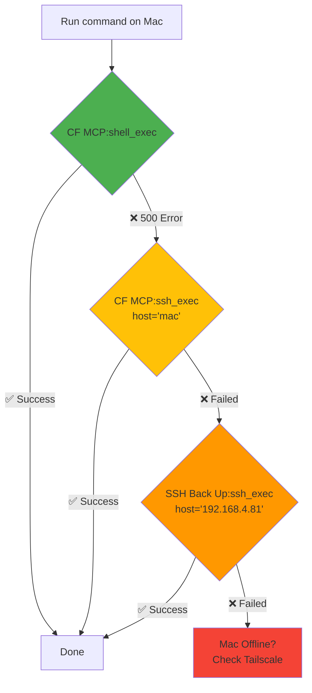
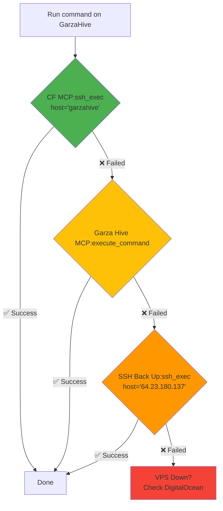
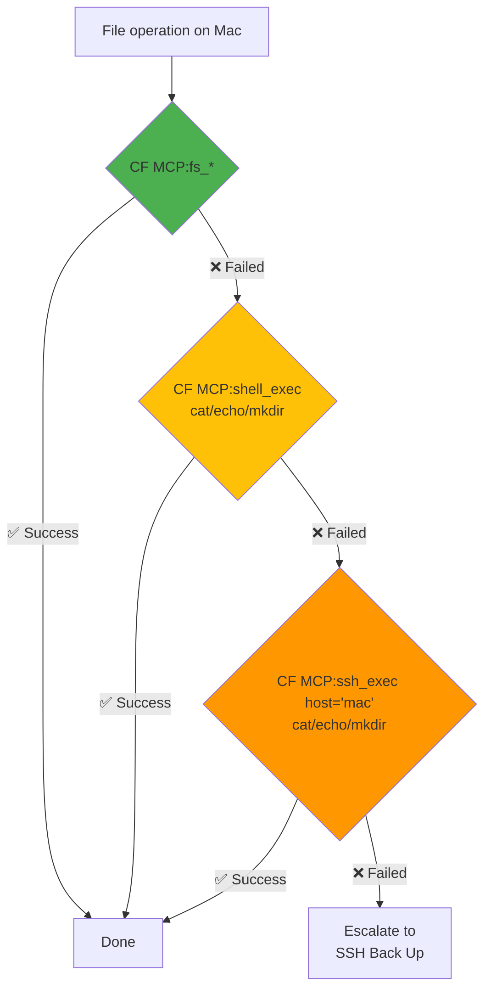
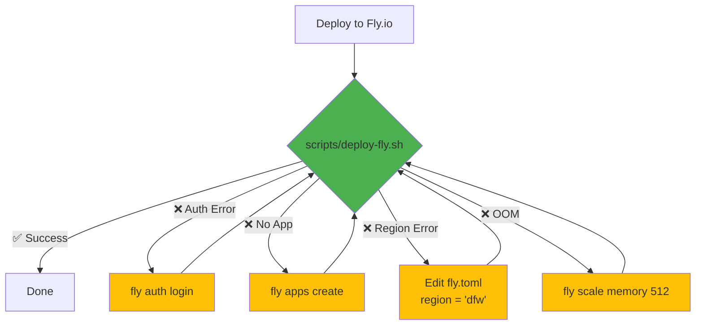
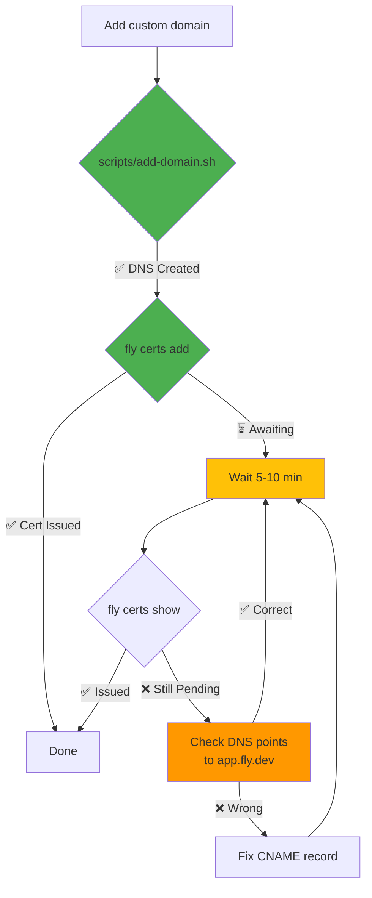
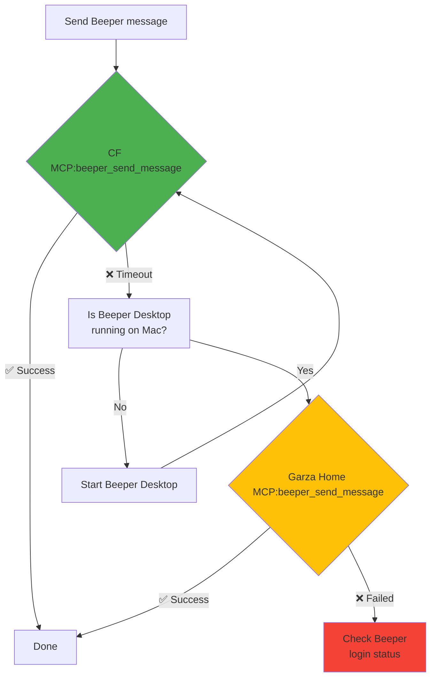
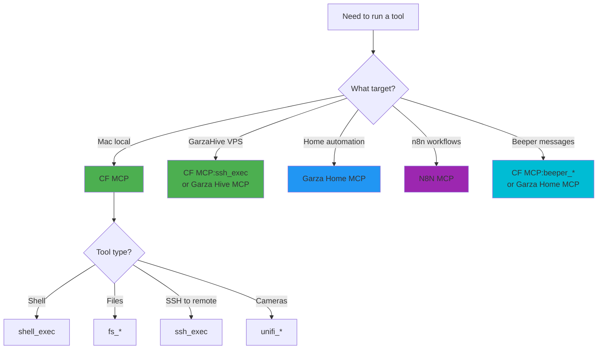

# Tool Fallback Decision Trees

> Visual representation of execution cascades. Copy mermaid blocks to preview.

---

## Mac Command Execution

---

## GarzaHive Command Execution

---

## File Operations on Mac

---

## Fly.io Deployment

---

## Domain + Certificate Setup

---

## Beeper Message Send

---

## MCP Tool Selection

---

## Quick Reference Table

| Target | Primary Tool | Fallback 1 | Fallback 2 |
|--------|--------------|------------|------------|
| Mac shell | `CF MCP:shell_exec` | `CF MCP:ssh_exec` host=mac | `SSH Back Up` IP=192.168.4.81 |
| Mac files | `CF MCP:fs_*` | `CF MCP:shell_exec` | `CF MCP:ssh_exec` |
| GarzaHive | `CF MCP:ssh_exec` host=garzahive | `Garza Hive MCP:execute_command` | `SSH Back Up` IP=64.23.180.137 |
| Beeper | `CF MCP:beeper_*` | `Garza Home MCP:beeper_*` | - |
| Cameras | `CF MCP:unifi_*` | `Garza Home MCP:unifi_*` | - |
| Abode | `Garza Home MCP:abode_*` | `Garza Hive MCP:abode_*` | - |
